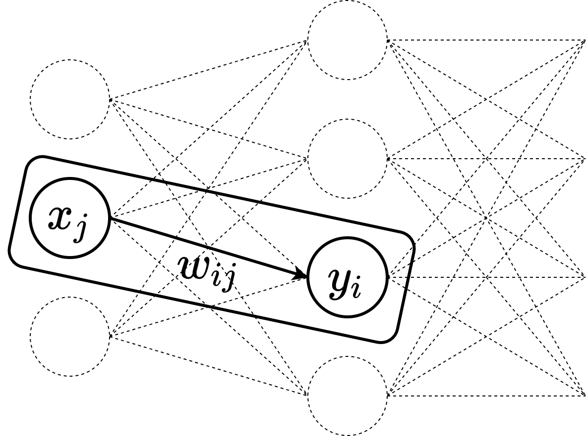
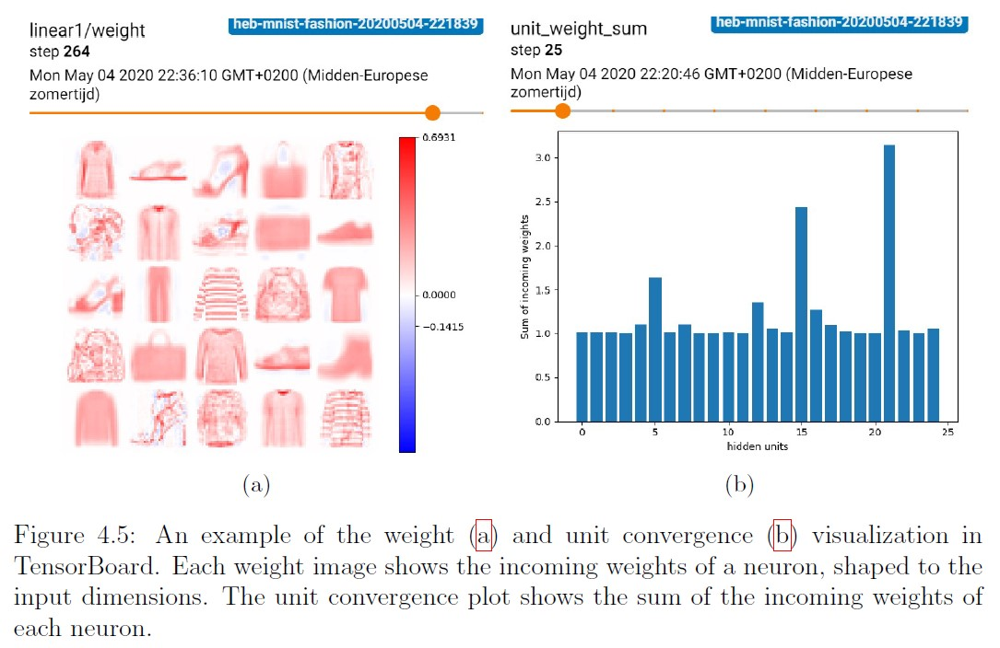

[![Issues][issues-shield]][issues-url]
[![MIT License][license-shield]][license-url]

<br />
<p align="center">
  <a href="https://github.com/Joxis/pytorch-hebbian">
    
  </a>

  <h3 align="center">PyTorch Hebbian</h3>

  <p align="center">
    A lightweight framework for Hebbian learning based on PyTorch Ignite. Presented at the <a href="https://beyondbackprop.github.io/">Beyond Backpropagation</a> NeurIPS 2020 worskhop.
  </p>
</p>

<!-- TABLE OF CONTENTS -->
## Table of Contents

* [About the Project](#about-the-project)
* [Getting Started](#getting-started)
* [Usage](#usage)
* [Contributing](#contributing)
* [License](#license)
* [Reference](#reference)
* [Contact](#contact)
* [Acknowledgements](#acknowledgements)

## About the project
A lightweight and flexible framework for Hebbian learning in PyTorch.

## Getting started
To get a local copy up and running follow these simple steps.

### Prerequisites
Depending on your system (OS/GPU/CUDA support) you may need to manually install a specific PyTorch version.
Please see the [PyTorch website](https://pytorch.org/get-started/locally/) for more information.

### Installation
Clone the repository:
```shell script
pip install git+https://github.com/Joxis/pytorch-hebbian.git
```

## Usage
Similar to a classic PyTorch pipeline, a model, dataset and data loader are first initiated.
Next, the framework requires you to specify a learning rule, optimizer and trainer. 
You can then start Hebbian learning.

### Simple example
```python
# Creating the model
model = models.create_fc1_model([28 ** 2, 400])

# Creating the dataset and data loaders
dataset = datasets.mnist.MNIST(root=config.DATASETS_DIR, download=True,
                               transform=transforms.ToTensor())
train_loader = DataLoader(dataset, batch_size=1024, shuffle=True)

# Creating the learning rule, optimizer and trainer
learning_rule = KrotovsRule()
optimizer = Local(named_params=model.named_parameters(), lr=0.01)
trainer = HebbianTrainer(model=model, learning_rule=learning_rule,
                         optimizer=optimizer)

# Running the trainer
trainer.run(train_loader=train_loader, epochs=10)
```

### Visualizations
Various TensorBoard visualizations are supported. Below are some examples.



See [examples](https://github.com/Joxis/pytorch-hebbian/tree/master/examples) for more.

## Contributing
Any contributions you make are **greatly appreciated**. For major changes, please open an issue first to discuss what you would like to change.

1. Fork the project
2. Create your feature branch (`git checkout -b feature/amazing-feature`)
3. Commit your changes (`git commit -m 'Add some amazing feature'`)
4. Push to the branch (`git push origin feature/amazing-feature`)
5. Open a pull request

## License
Distributed under the MIT License. See [LICENSE](https://github.com/Joxis/pytorch-hebbian/blob/master/LICENSE) for more information.

## Reference
Please consider citing this work if it helps your research.
```
@inproceedings{talloen2020pytorchhebbian,
  author       = {Jules Talloen and Joni Dambre and Alexander Vandesompele},
  location     = {Online},
  title        = {PyTorch-Hebbian: facilitating local learning in a deep learning framework},
  year         = {2020},
}
```

## Contact
Jules Talloen - `<firstname>@<lastname>.eu`

Project Link: [https://github.com/Joxis/pytorch-hebbian](https://github.com/Joxis/pytorch-hebbian)

<!-- ACKNOWLEDGEMENTS -->
## Acknowledgements
* [Ghent University - IDLab](https://www.ugent.be/ea/idlab/en)
* [ML6](https://ml6.eu/)

<a href="https://ml6.eu/">
    
</a>

<!-- MARKDOWN LINKS & IMAGES -->
<!-- https://www.markdownguide.org/basic-syntax/#reference-style-links -->
[issues-shield]: https://img.shields.io/github/issues/Joxis/pytorch-hebbian
[issues-url]: https://github.com/Joxis/pytorch-hebbian/issues
[license-shield]: https://img.shields.io/github/license/Joxis/pytorch-hebbian
[license-url]: https://github.com/Joxis/pytorch-hebbian/blob/master/LICENSE
